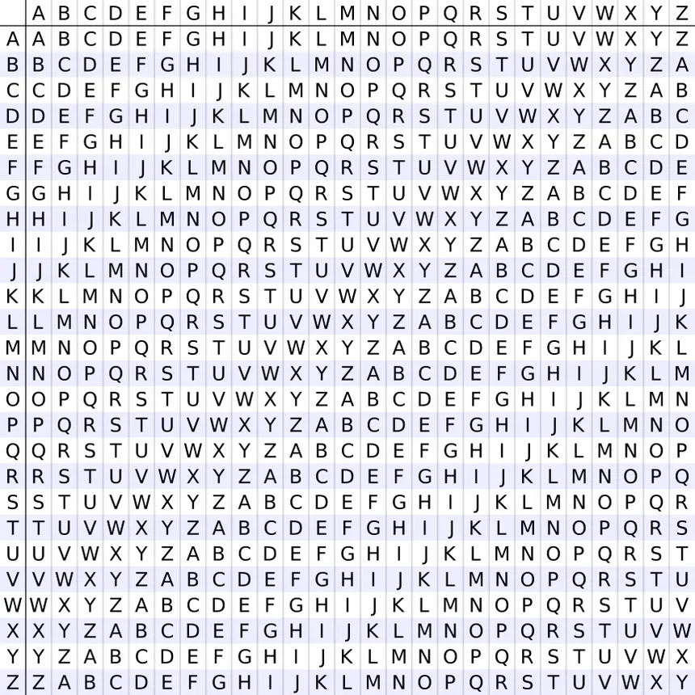

# Vigenère cipher

Vigenere Cipher is a method of encrypting alphabetic text. It uses a simple form of polyalphabetic substitution. A polyalphabetic cipher is any cipher based on substitution, using multiple substitution alphabets. The encryption of the original text is done using the Vigenère square or Vigenère table.

The table consists of the alphabets written out 26 times in different rows, each alphabet shifted cyclically to the left compared to the previous alphabet, corresponding to the 26 possible Caesar Ciphers.
* At different points in the encryption process, the cipher uses a different alphabet from one of the rows.
* The alphabet used at each point depends on a repeating keyword.

## Example
```
Input: plaintext: UTACSEC
    keyword: ilovecsec
Output: Ciphertext: CEOXWGU
```
## Vigenere square



## Encryption:

The first letter of the plaintext, U is paired with I, the first letter of the key. So use row U and column I of the Vigenère square, namely C. Similarly, for the second letter of the plaintext, the second letter of the key is used, the letter at row T, and column L is E. The rest of the plaintext is enciphered in a similar fashion. 

## Decryption:
Decryption is performed by going to the row in the table corresponding to the key, finding the position of the ciphertext letter in this row, and then using the column’s label as the plaintext. For example, in row I (from ilovecsec), the ciphertext C appears in column U, which is the first plaintext letter. Next, we go to row L (from ilovecsec), locate the ciphertext T which is found in column T, thus T is the second plaintext letter.

### Sources
- https://www.geeksforgeeks.org/vigenere-cipher/